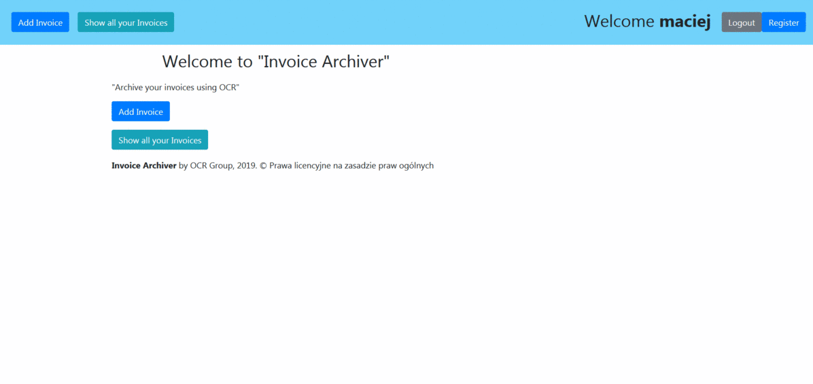
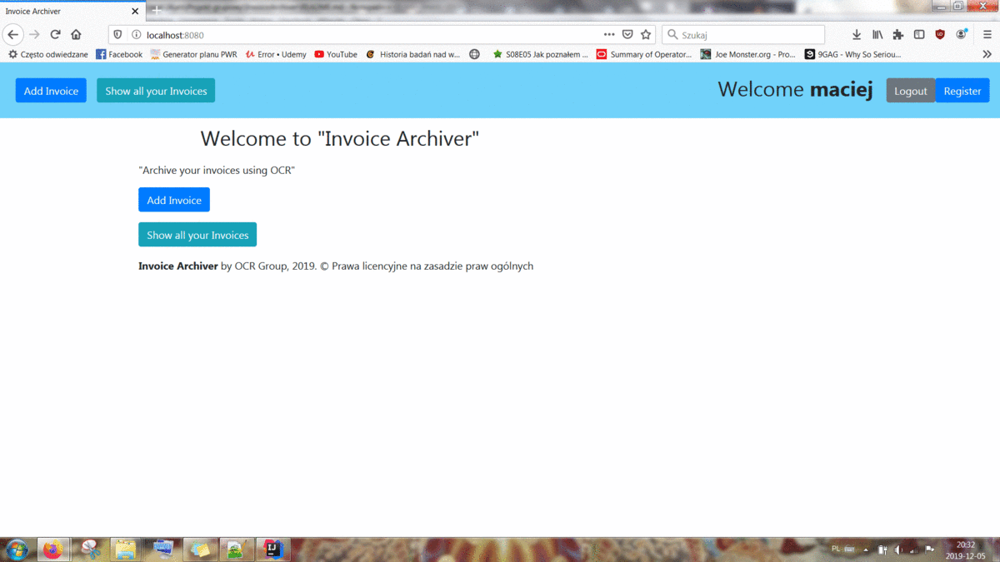

# InvoiceArchiver

Aplikacja InvoiceArchiver służy do archiwizowania faktur przy użyciu oprogramowania OCR.

Przed przystąpić do pracy należy dokonać rejestracji przy pomocy przycisku `Register`.

Podajemy swoje dane: nazwę użytkownika, hasło, imię oraz nazwisko. Do aplikacji logujemy się za pomocą przycisku `Login` podając swój login i hasło.

Przycisk `Add Invoice` pozwala nam na dodanie faktury do bazy danych.

Za pomocą przycisku `Upload` wczytujemy fakturę (w formacie "pdf" lub "JPG").
Dane faktury powinny uzupełnić się automatycznie lub można je wpisać ręcznie. Zatwierdzamy przyciskiem `Add`.

Aplikacja pozwala przeglądać dodane przez użytkownika faktury za pomocą funkcji `Show all your invoices`.

Każdą fakturę można pobrać za pomocą przycisku `Download`.

